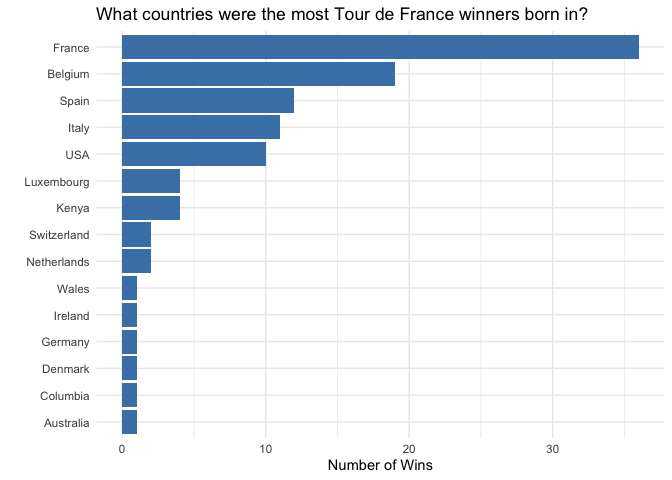
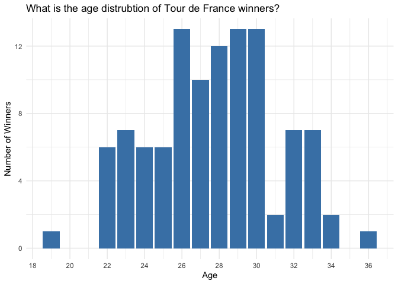
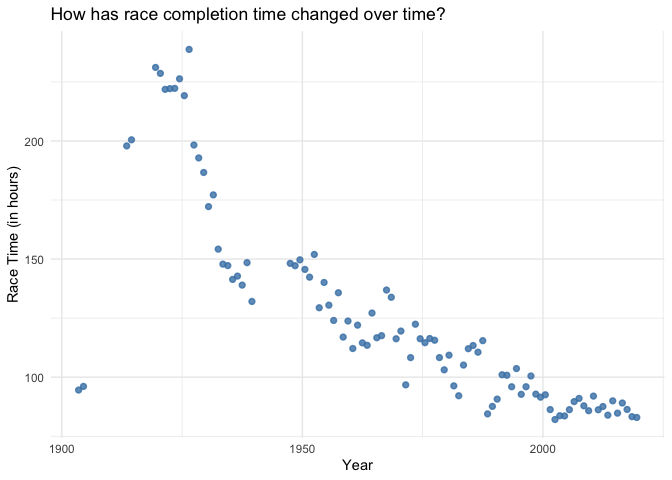
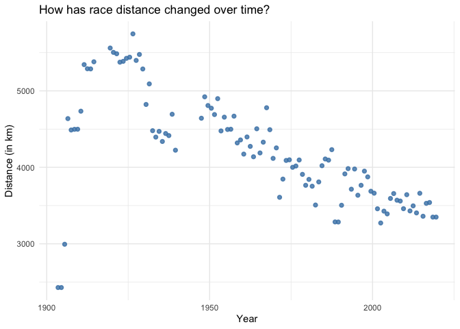
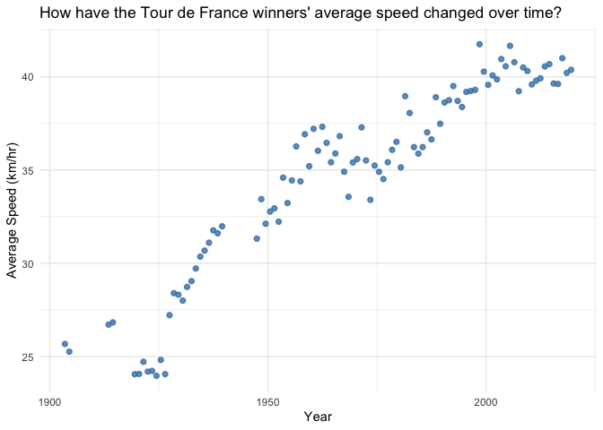
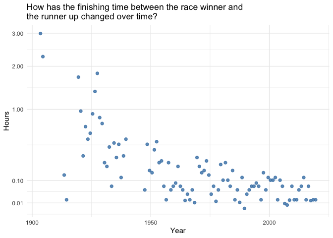

Tidy Tuesday: Tour de France
================

Tidy Tuesday
------------

This is my first (published) analysis of Tidy Tuesday data. Tidy Tuesday is a data project that allows anyone to practice their wrangling and data visualization skills on weekly posted datasets. Check out out the [Tidy Tuesday GitHub repo](https://github.com/rfordatascience/tidytuesday) to learn more and [\#TidyTuesday on Twitter](https://twitter.com/hashtag/tidytuesday) to see some examples.

Tour de France - Intro
----------------------

This Tidy Tuesday analysis revolves around Tour de France data. [Tour de France](https://en.wikipedia.org/wiki/Tour_de_France) is the world's most prestegious and difficult bicycle race that occurs every summer in France. The route is completed by teams of 9 and made up of 21 day-long stages taking place over the course of 23 days. The race has been held annually since 1903, stopping only for the two World Wars. It is the world’s largest annual sporting event, garnering millions of spectators and over a billion of televised views every year.

Questions
---------

After taking a look at the data, here are some of the questions I wanted to dive into:

-   What countries were the most winners born in?
-   What is the age distrubtion of the winners?
-   How has race completion time and distance changed over time?
-   How have the winners' average speed changed over time?
-   How has the finishing time between the race winner and the runner up changed over time?

Analysis
--------

First things first, let's load our packages and data.

``` r
# Load packages
library(tidyverse)

# Load data
tdf_winners <- read_csv("https://raw.githubusercontent.com/rfordatascience/tidytuesday/master/data/2020/2020-04-07/tdf_winners.csv")
```

### What countries were the most winners born in?

To tackle my first question, I did a simple `count()` to calculate the number of times each birth country occurred.

``` r
# Plot of wins by winner's birth country
tdf_winners %>% 
  count(birth_country, sort = TRUE) %>% 
  mutate(birth_country = fct_reorder(birth_country, n)) %>% 
  ggplot(aes(x = birth_country, y = n)) +
  geom_col(fill = "steelblue") +
  coord_flip() + 
  theme_minimal() +
  labs(title = "What countries were the most Tour de France winners born in?",
       x = "",
       y = "Number of Wins")
```



We can see that most Tour de France winners were born in France, which isn't too surprising given the name of the race and it's origins.

### What is the age distrubtion of the winners?

Another quick exploratory plot we can look at is the age distrubution of Tour de France winners. Just like above, we can take a `count()` of the age occurrance in the data.

``` r
# Age distribution of winners
tdf_winners %>% 
  count(age, sort = TRUE) %>% 
  ggplot(aes(x = age, y = n)) +
  geom_col(fill = "steelblue") +
  theme_minimal() +
  scale_x_continuous(breaks = seq(18,36,2)) +
  scale_y_continuous(breaks = seq(0,12,4)) +
  labs(title = "What is the age distrubtion of Tour de France winners?",
       x = "Age",
       y = "Number of Winners")
```



While there does seem to be a noticable cluster around bikers aged 26-30, there is still a fair number of them in the range of 22-34.

### How has race completion time and distance changed over time?

Now, let's take a look at the change in winner completion time and the distance of the race over time. It is important to note that there is no data for completion time between 1905 and 1912, so that data is excluded from the plot. After doing some [research](https://en.wikipedia.org/wiki/1905_Tour_de_France), I discovered that rule changes made in 1905 (and reverted in 1913) resulted in the winner being determined by points instead of time.

``` r
# Race completion time over time
tdf_winners %>% 
  ggplot(aes(x = start_date, y = time_overall)) + 
  geom_point(color = "steelblue", alpha = .8, stroke = .8) + 
  theme_minimal() +
  labs(title = "How has race completion time changed over time?",
       x = "Year",
       y = "Race Time (in hours)")
```



``` r
# Race distance over time
tdf_winners %>% 
  ggplot(aes(x = start_date, y = distance)) + 
  geom_point(color = "steelblue", alpha = .8, stroke = .8) + 
  theme_minimal() +
  labs(title = "How has race distance changed over time?",
       x = "Year",
       y = "Distance (in km)")
```



Race completion time has dropped significantly over the years, which can be attributed to the simultaneous drop in race distance. While the early editions of the Tour de France were much longer and seemingly much more difficult, this does not at all mean that the races of today are easy. The types of stages also play a factor in the races, which is an idea for a future potential analysis.

### How have the winners' average speed changed over time?

With race distance decreasing over the years, race speed is likely another factor that has been affected. Calculating average speed to be the total distance in kilometers over the overall race time in hours, we get the following plot.

``` r
# Winners' average speed
tdf_winners %>% 
  mutate(avg_speed = distance/time_overall) %>% 
  ggplot(aes(x = start_date, y = avg_speed)) + 
  geom_point(color = "steelblue", alpha = .8, stroke = .8) + 
  theme_minimal() + 
  labs(title = "How have the Tour de France winners' average speed changed over time?",
       x = "Year",
       y = "Average Speed (km/hr)")
```



While race distance has been gradually decreasing, the average winner's speed has been gradually increasing. We see that there has been an increase of approximately 15km/hr over the years.

### How has the finishing time between the race winner and the runner up changed over time?

The Tour de France began as a publicity stunt for a newspaper and is now the world's largest annual sporting event. With bicyclists around the world joining the race, the competition increases. We can view this competition by taking a look at the difference in finishing time between the race winner and the runner up over time.

``` r
# Runner up finishing time difference
tdf_winners %>% 
  ggplot(aes(x = start_date, y = time_margin)) + 
  geom_point(color = "steelblue", alpha = .8, stroke = .8) + 
  scale_y_sqrt(breaks = c(0.01, 0.1, 1, 2, 3)) + 
  expand_limits(y = 0.1) +
  theme_minimal() +
  labs(title = "How has the finishing time between the race winner and \nthe runner up changed over time?",
       x = "Year",
       y = "Hours")
```



As we can see here, the races are getting much closer as time progresses. While early winners won by 1-3 hours, recent winners have consistently been winning by mere minutes.

Taking a look at the smallest time margins, we can see how extreme they can get.

``` r
# Smallest runner up finishing time difference
tdf_winners %>% 
  select(start_date, winner_name, time_margin) %>% 
  arrange(time_margin) %>%
  top_n(-5)
```

    ## Selecting by time_margin

    ## # A tibble: 5 x 3
    ##   start_date winner_name      time_margin
    ##   <date>     <chr>                  <dbl>
    ## 1 1989-07-01 Greg LeMond          0.00222
    ## 2 2007-07-07 Alberto Contador     0.00639
    ## 3 2006-07-01 Óscar Pereiro        0.00889
    ## 4 1968-06-27 Jan Janssen          0.0106 
    ## 5 1987-07-01 Stephen Roche        0.0111

These 5 margins translate to a range of approximately 8-45 seconds separating the winner's competion time and the runner up's time.

### Conclusion

It's quite interested to see how the trends in race distance, time, racer speed, and runner up finishing time difference change over time. For future analyses, digging into the stage data and data from all competitors might be worthwile as well. It's not often that you can analyze over a hundred years worth of data and I am curious what the trends will look like in 10, 20, 50 and 100 years from now. As rules change (as they did in 1905), bicycle technology improves, and humans evolve, we are bound to see even more exciting changes.
