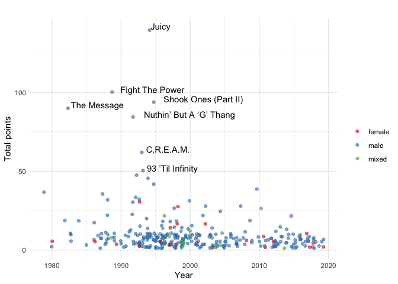

Tidy Tuesday: analyzing hip-hop data
================

Intro
-----

This Tidy Tuesday analysis revolves around hip-hop data and song ratings by critics within the genre.

From the [Tidy Tuesday GitHub repo and related article](https://github.com/rfordatascience/tidytuesday/blob/master/data/2020/2020-04-14/readme.md):

> Earlier this year, BBC Music asked more than 100 critics, artists, and other music industry folks from 15 countries for their five favorite hip-hop tracks. Then they broke down the results of the poll into one definitive list. But BBC Music didn’t just publish a best-of list, they also published the complete poll results and a description of the simple algorithm they ranked the songs with. - Simon Jockers

> We awarded 10 points for first ranked track, eight points for second ranked track, and so on down to two points for fifth place. The song with the most points won. We split ties by the total number of votes: songs with more votes ranked higher. Any ties remaining after this were split by first place votes, followed by second place votes and so on: songs with more critics placing them at higher up the lists up ranked higher. -- BBC Music

Questions
---------

-   Which songs received the most points?
-   What is the distribution of nominated song release years and song points over time?
-   What is the distribution of artist genders?
    -   How has the distribution of artist genders changed over time?
-   What is the distribution of critics' roles?
-   What is the distribution of critics' primary country?

Analysis
--------

Let's start by loading our packages and data. From now on, I'll be using the convenient `tidytuesdayR` package to load weekly data (instead of reading it with the link to the raw GitHub files).

``` r
# Load packages
#devtools::install_github("thebioengineer/tidytuesdayR")
library(tidytuesdayR)
library(tidyverse)
library(RcppRoll)

# Load data
tt_data <- tt_load(2020, week = 16)
artist_polls <- tt_data$polls
artist_rankings <- tt_data$rankings
```

While performing my analysis, I discovered an error in one of the observations of the song "All Of The Lights" by Kanye West ft. Rihanna & Kid Cudi.

``` r
# Show row errors
artist_polls %>% 
  filter(title == "All Of The Lights")
```

    ## # A tibble: 3 x 9
    ##    rank title artist gender  year critic_name critic_rols critic_country
    ##   <dbl> <chr> <chr>  <chr>  <dbl> <chr>       <chr>       <chr>         
    ## 1     1 All … Kanye… male    2010 Kish Lal    Critic      US            
    ## 2     2 All … Kanye… mixed   2010 Dan Runcie  Trapital    US            
    ## 3     2 All … Kanye… mixed   2010 Jan Wehn    Critic      Germany       
    ## # … with 1 more variable: critic_country2 <chr>

``` r
# Show row errors
artist_rankings %>% 
  filter(title == "All Of The Lights") 
```

    ## # A tibble: 2 x 12
    ##      ID title   artist    year gender points     n    n1    n2    n3    n4    n5
    ##   <dbl> <chr>   <chr>    <dbl> <chr>   <dbl> <dbl> <dbl> <dbl> <dbl> <dbl> <dbl>
    ## 1    43 All Of… Kanye W…  2010 mixed      16     2     0     2     0     0     0
    ## 2    70 All Of… Kanye W…  2010 male       10     1     1     0     0     0     0

The gender of the artists should be `mixed` so I edited the labels and point/vote calculations in the polls and rakings datasets.

``` r
# Fix error in artist_polls
error_polls <- which(artist_polls$title == "All Of The Lights" & artist_polls$gender == "male")
artist_polls$gender[error_polls] <- "mixed"

# Fix error in artist_rankings
# Get indices of correct and error rows
error_rankings <- which(artist_rankings$title == "All Of The Lights" & artist_rankings$gender == "male")
correct_rankings <- which(artist_rankings$title == "All Of The Lights" & artist_rankings$gender == "mixed")

# Add points/votes
artist_rankings[correct_rankings, 6:12] <- artist_rankings[correct_rankings, 6:12] + artist_rankings[error_rankings, 6:12]

# Remove error row
artist_rankings <- artist_rankings[-c(error_rankings), ]
```

### Which songs received the most points?

Starting off simple, let's take a look at the songs that received the most points. Each of the 300+ songs received at least 2 points, so we'll limit the plot to the top ten.

``` r
# Top 10 songs 
artist_rankings %>% 
  top_n(10, points) %>% 
  mutate(title_artist = paste0(title, "\nby ", artist),
         title_artist = fct_reorder(title_artist, points)) %>% 
  ggplot(aes(x = title_artist, y = points)) + 
  geom_col(fill = "steelblue") + 
  coord_flip() + 
  theme_minimal() + 
  theme(axis.text.y = element_text(hjust = 0)) +
  labs(title = "Which songs received the most points?",
       x = "",
       y = "Total points")
```


### What is the distribution of nominated song releases and song points over time?

Hip-hop has a very interesting [history](https://genius.com/Bmxe-the-history-of-hip-hop-music-annotated) and the next thing that I wanted to look at was the how the release years and total points of these 300+ nominated songs were distributed over time.

``` r
# Number of nominated songs released per year
artist_rankings %>% 
  count(year) %>% 
  ggplot(aes(x = year, y = n)) + 
  geom_col(fill = "steelblue") + 
  theme_minimal() + 
  labs(title = "Number of nominated songs released per year",
       x = "Year",
       y = "Number of songs")
```


``` r
# Total number of points awarded per year
artist_rankings %>% 
  group_by(year) %>% 
  summarize(yearly_points = sum(points)) %>% 
  ggplot(aes(x = year, y = yearly_points)) + 
  geom_col(fill = "steelblue") + 
  theme_minimal() + 
  labs(title = "Number of song points awarded by release year",
       x = "Year",
       y = "Points")
```


Both plots show a significant increase in the 90s, which is consistent with the genre [becoming a best-selling music genre in the mid-1990s and the top selling music genre by 1999](https://en.wikipedia.org/wiki/Hip_hop_music#Mainstream_breakthrough).

### What is the distribution of artist genders?

The next thing I wanted to look at was the gender distribution of artists in the list of nominated songs.

``` r
# Artist gender distribution
artist_rankings %>% 
  count(gender)
```

    ## # A tibble: 3 x 2
    ##   gender     n
    ##   <chr>  <int>
    ## 1 female    23
    ## 2 male     267
    ## 3 mixed     20

With 267 of the 300+ nominated songs having male artists, we can definitely notice how [male-dominated](http://www.bbc.com/culture/story/20191007-why-are-there-so-few-women-in-best-of-hip-hop-polls) the space is.

It is important to note that the numbers above **are** counting duplicates of artists who produced multiple songs in the list of 300+ nominated songs.

For unique artists, we can do this:

``` r
# Artist gender distribution, no duplicates
artist_rankings %>% 
  distinct(artist, .keep_all = TRUE) %>% 
  count(gender)
```

    ## # A tibble: 3 x 2
    ##   gender     n
    ##   <chr>  <int>
    ## 1 female    18
    ## 2 male     169
    ## 3 mixed     20

However this still doesn't account for artists collaborating with different combinations of other artists. We could extract artists featured in songs (by extracting names separated by "ft.", "feat", "and", and "&"), but not all are hip-hop artists and it would require additional work to determine the gender of the artists from gender-mixed collaborative songs.

#### How has the distribution of artist genders changed over time?

Given the caveat of duplicate artists mentioned above, here is what the distribution of artists genders looks like for the nominated songs over time:

``` r
# Distribution of artist genders over time
artist_rankings %>% 
  group_by(year, gender) %>% 
  count(gender) %>% 
  ggplot(aes(x = year, y = n, fill = gender)) +
  geom_col() + 
  facet_wrap(~gender) +
  theme(legend.position = "none") +
  labs(title = "Number of songs per artist gender over time",
       x = "Year",
       y = "Number of songs")
```


### Visualizing points, gender, and time together

Now that we've taken a look at points, gender, and time separately, let's view how they all interact together.

``` r
artist_rankings %>% 
  ggplot(aes(x = year, y = points, color = gender, label = title)) +
  geom_jitter(alpha = 0.6) + 
  geom_text(aes(label = ifelse(points >= 50, title, "")), 
            color = "black", 
            hjust = -0.1, 
            vjust = 0) +
  scale_color_brewer(palette="Set1") +
  theme_minimal() +
  labs(title = "",
       x = "Year",
       y = "Total points",
       color = "")
```



### What is the distribution of critics' roles?

While the votes/points for these songs were done by [critics, industry figures, artists, academics in the field of hip-hop and music](http://www.bbc.com/culture/story/20191007-the-greatest-hip-hop-songs-of-all-time-who-voted), it is important to keep in mind that music is a subjective field. We can take a quick look at some of the top roles of those critics:

``` r
# Top critic roles
artist_polls %>% 
  distinct(critic_name, .keep_all = TRUE) %>% 
  mutate(role_lump = fct_lump(critic_rols, 6)) %>% 
  count(role_lump, sort = TRUE) %>% 
  mutate(role_lump = fct_reorder(role_lump, n)) %>% 
  ggplot(aes(x = role_lump, y = n)) +
  geom_col(fill = "steelblue") + 
  coord_flip() + 
  theme_minimal() + 
  labs(title = "What is the distribution of critics' roles?",
       x = "Critic's role",
       y = "Number of critics")
```


While there does exist a large range of unique companies and roles, the label "Critic" is the only consistently specific role, which isn't quite descriptive enough to draw further insight from. The rest of the roles in "Other" are unique enough (each only existing once) that they are not able to be generalized further without manual classification.

### What is the distribution of critics' primary country?

The last thing I wanted to investigate was the countries from which the critics were taken from.

``` r
artist_polls %>% 
  distinct(critic_name, .keep_all = TRUE) %>% 
  count(critic_country) %>% 
  mutate(critic_country = reorder(critic_country, n)) %>% 
  ggplot(aes(x = critic_country, y = n)) +
  geom_col(fill = "steelblue") + 
  coord_flip() + 
  theme_minimal() + 
  labs(title = "What is the distribution of critics' primary country?",
       x = "Critic's country",
       y = "Number of critics")
```


Given the fact that hip-hop originated and developed in the United States, it is not surprising that the majority of the critics polled were from there. This does give a bit more context to the statement "We polled 108 critics from 15 countries across six continents" by the BBC. It is interesting to see critics from countries that I hadn't expected, such as China, Japan, India, and Russia.
