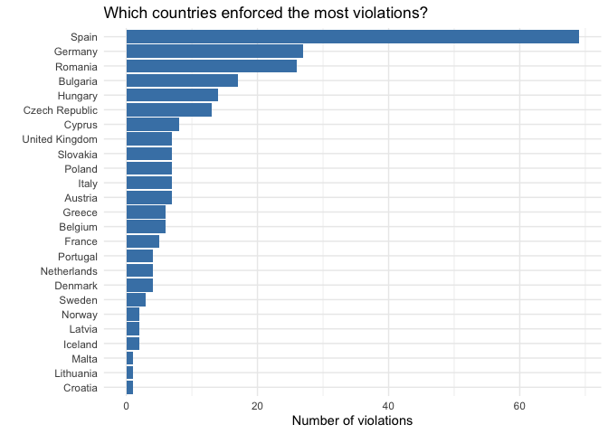
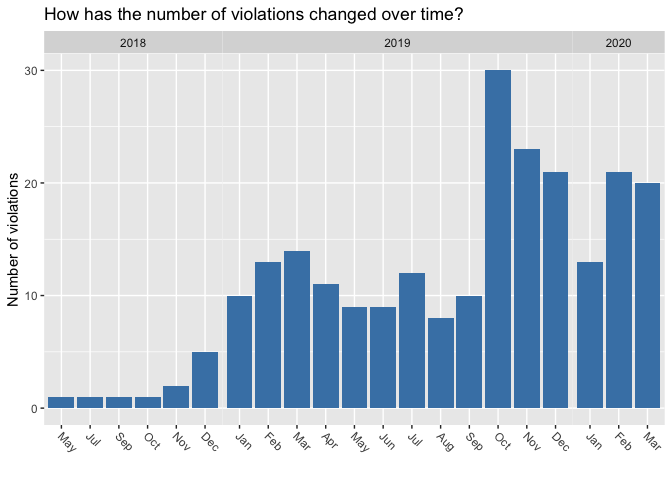
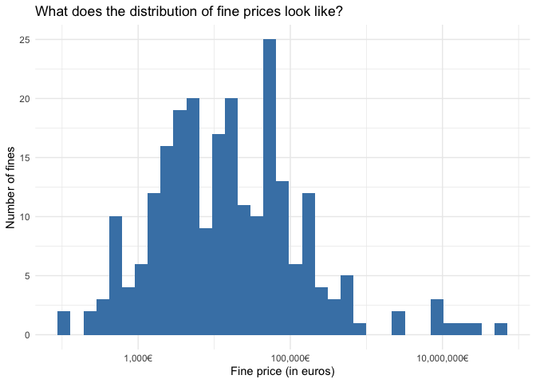
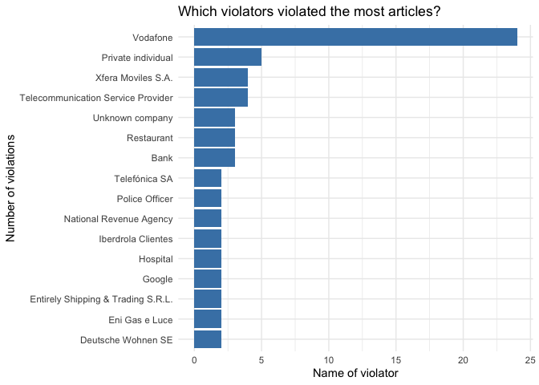
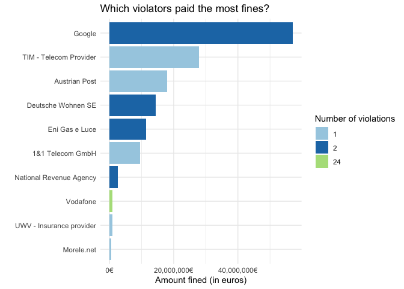
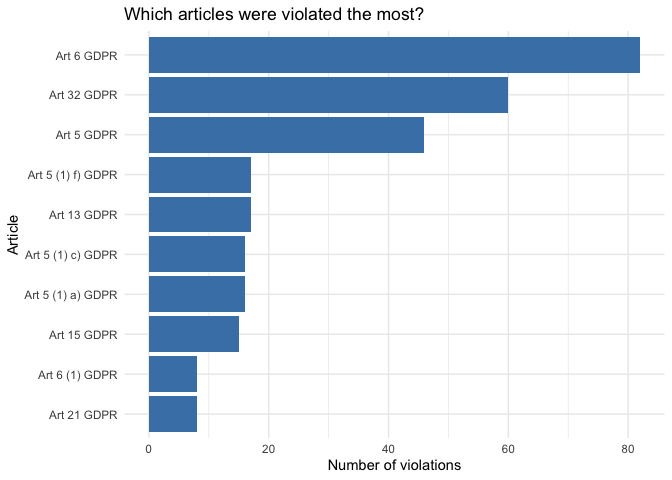

Tidy Tuesday: analyzing GDPR violations
================

Introduction
------------

Data protection and privacy is a growing concern for many as we move into a society where data can be monetized and utilized across a wide range of fields. This week's Tidy Tuesday data consists of GDPR violations from [Privacy Affairs](https://www.privacyaffairs.com/gdpr-fines/). From the [Tidy Tuesday GitHub repo and related Wikipedia article](https://en.wikipedia.org/wiki/General_Data_Protection_Regulation):

> The General Data Protection Regulation (EU) 2016/679 (GDPR) is a regulation in EU law on data protection and privacy in the European Union (EU) and the European Economic Area (EEA). It also addresses the transfer of personal data outside the EU and EEA areas. The GDPR aims primarily to give control to individuals over their personal data and to simplify the regulatory environment for international business by unifying the regulation within the EU.\[1\] Superseding the Data Protection Directive 95/46/EC, the regulation contains provisions and requirements related to the processing of personal data of individuals (formally called data subjects in the GDPR) who reside in the EEA, and applies to any enterprise—regardless of its location and the data subjects' citizenship or residence—that is processing the personal information of data subjects inside the EEA.

Questions
---------

-   Which countries enforced the most violations?
-   How has the number of violations changed over time?
-   What does the distribution of fine prices look like?
-   Which violators violated the most articles?
-   Which violators have paid the most fines?
-   What are the most common types of violations?
-   Which articles were violated the most?
-   Which types of violations incurred the most fines?

Analysis
--------

Let's start by loading our packages and data.

``` r
# Load packages
library(tidytuesdayR)
library(tidyverse)
library(lubridate)
library(plotly)
library(htmlwidgets)

# Load data (unable to use tt_load() this week)
# tt_data <- tt_load(2020, week = 17)
gdpr_violations <- read_tsv('https://raw.githubusercontent.com/rfordatascience/tidytuesday/master/data/2020/2020-04-21/gdpr_violations.tsv')
```

### Which countries are violations most enforced in?

There are 120 countries where violations were enforced in, so let's first look at what that distribution of enforcement looks like.

``` r
# Violation enforcements by country
gdpr_violations %>%
  count(name) %>%
  mutate(name = fct_reorder(name, n)) %>%
  ggplot(aes(name, n)) +
  geom_col(fill = "steelblue") +
  coord_flip() +
  theme_minimal() +
  labs(title = "Which countries enforced the most violations?",
       x = "",
       y = "Number of violations")
```



We can see that Spain enforced the most violations by far, having over double the number of enforcements as the next highest country.

### How has the number of violations changed over time?

The provided data ranges from May of 2018 to March of 2020, with a handful of observations from January of 1970. Taking a closer look at the observations of 1970 and the source of the data, I discovered that the date for these values are actually unknown.

``` r
gdpr_violations_clean <- gdpr_violations %>%
  mutate(date = replace(date, date == "01/01/1970", NA))
```

After correcting the 1970 observations, we can move to plotting the number of violations over time.

``` r
# Violations over time
gdpr_violations_clean %>%
  filter(!is.na(date)) %>%
  mutate(date = mdy(date)) %>%
  mutate(month = month(date),
         month_abbr = month(date, label = TRUE),
         year = year(date)) %>%
  count(year, month, month_abbr) %>%
  ggplot(aes(month_abbr, n)) +
  geom_col(fill = "steelblue") +
  facet_grid(~year, scales = "free_x", space = "free_x") +
  theme(panel.spacing.x = unit(0, "cm"),
        axis.text.x = element_text(angle = -45, hjust = -.1, vjust = 1)) +
  labs(title = "How has the number of violations changed over time?",
       x = "",
       y = "Number of violations")
```



We can see that there has been a gradual increase in violations, with the highest number of violations per month reaching 30 in October of 2018.

### What does the distribution of fine prices look like?

The next thing I wanted to look at was teh distribution of fine prices. I recall that there have been some large companies that were required to pay some pretty hefty fines due to issues with data protection in the past couple of years. However, that doesn't paid a full picture of what other violators are being fined.

``` r
# Remove scientific notation
options(scipen=10000)

# Distribution of fine prices
gdpr_violations_clean %>%
  ggplot(aes(price)) +
  geom_histogram(fill = "steelblue", bins = 35, na.rm = TRUE) +
  scale_x_log10(labels = scales::dollar_format(suffix = "\u20AC", prefix = "")) +
  theme_minimal() +
  labs(title = "What does the distribution of fine prices look like?",
       x = "Fine price (in euros)",
       y = "Number of fines")
```



As expected, there are a few instances of fines in the 10 million and over range, but it seems that the majority of fines fall between 1,000 and 100,000 euros.

### Which violators violated the most articles?

While inspecting the names of the violators, I noticed that there were quite a few duplicate names that were off by a capitalization or a few letters. There were also instances where the violators were either unknown, unavailable, or not disclosed. In order to keep consistency, I renamed those violators to the best of my ability.

``` r
# Rename unavailable and duplicate violators
missing_violators <- c("Unknown", "Unknwon", "Not available", "Not disclosed", "Not known")
gdpr_violations_rn <- gdpr_violations_clean %>%
  mutate(controller = case_when(controller %in% missing_violators ~ NA_character_,
                                controller %in% c("Bank", "Bank (unknown)") ~ "Bank",
                                controller %in% c("Google", "Google Inc.") ~ "Google",
                                controller %in% c("Unknown company", "Company") ~ "Unknown company",
                                controller %in% c("Telecommunication service provider", "Telecommunication Service Provider") ~ "Telecommunication Service Provider",
                                controller %in% c("Unicredit Bank", "Unicredit Bank SA") ~ "Unicredit Bank",
                                controller %in% c("Vodafone Espana", "Vodafone España", "Vodafone España, S.A.U.", "Vodafone Romania", "Vodafone ONO") ~ "Vodafone",
                                TRUE ~ as.character(controller)))

# How many violators had no name
sum(is.na(gdpr_violations_rn$controller))
```

    ## [1] 28

Here we can see that 28 of the violators did not have a name, so we will be excluding them from the following plot of violators/controllers of data that violated the most articles.

``` r
# Violators with most violated articles
gdpr_violations_rn %>%
  filter(!is.na(controller)) %>%
  count(controller) %>%
  mutate(controller = fct_reorder(controller, n)) %>%
  filter(n > 1) %>%
  ggplot(aes(x = controller, y = n)) +
  geom_col(fill = "steelblue") +
  coord_flip() +
  theme_minimal() +
  labs(title = "Which violators violated the most articles?",
       x = "Number of violations",
       y = "Name of violator")
```



Vodafone had the largest number of violations by far, with 24 violations. Vodafone Group plc is a multinational telecommunications company whose subsidiaries include Vodafone España, Vodafone Romania, and Vodafone ONO.

### Which violators have paid the most fines?

While Vodafone had the largest number of violations, let's take a look at which violations were most severe by plotting the violators that paid the largest cummulative fines?

``` r
# Violators with highest fines
gdpr_violations_rn %>%
  filter(!is.na(controller)) %>%
  group_by(controller) %>%
  summarize(sum_price = sum(price),
            nb_violations = n()) %>%
  mutate(controller = fct_reorder(controller, sum_price)) %>%
  top_n(10, sum_price) %>%
  ggplot(aes(x = controller, y = sum_price, fill = factor(nb_violations))) +
  geom_col() +
  coord_flip() +
  scale_y_continuous(labels = scales::dollar_format(suffix = "\u20AC", prefix = "")) +
  # scale_fill_hue(c=75, l=80) +
  scale_fill_brewer(palette = "Paired") +
  theme_minimal() +
  labs(title = "Which violators paid the most fines?",
       x = "",
       y = "Amount fined (in euros)",
       fill = "Number of violations")
```



While Vodafone had the largest number of violations, it is 8th on the list with less than 1 million euros in total fines. Google takes the top with cummulative fines of 57 million euros over two separate fines.

### What are the most common types of violations?

Given the amount of text for the types of violations, I decided that a plot wouldn't be the best way to communicate the data. However, we can still look at a table of the most common violations.

``` r
# Top types of violations
gdpr_violations %>%
  count(type, sort = TRUE) %>%
  top_n(9)
```

    ## # A tibble: 11 x 2
    ##    type                                                                        n
    ##    <chr>                                                                   <int>
    ##  1 Non-compliance with lawful basis for data processing                      112
    ##  2 Failure to implement sufficient measures to ensure information security    59
    ##  3 Failure to comply with data processing principles                          17
    ##  4 Information obligation non-compliance                                      17
    ##  5 Non-compliance with subjects' rights protection safeguards                 16
    ##  6 Non-cooperation with Data Protection Authority                              6
    ##  7 Failure to comply with processing principles                                3
    ##  8 Non-compliance with the right of consent                                    3
    ##  9 Insufficient fulfilment of information obligations                          2
    ## 10 Non-compliance (Data Breach)                                                2
    ## 11 Several                                                                     2

### Which articles were violated the most?

Taking a look at the data, we see that the `article_violated` column is a list of all articles violated for that specific observation, separated by a pipe.

``` r
# View format of articles_violated
gdpr_violations %>%
  select(article_violated) %>%
  head()
```

    ## # A tibble: 6 x 1
    ##   article_violated                                        
    ##   <chr>                                                   
    ## 1 Art. 28 GDPR                                            
    ## 2 Art. 12 GDPR|Art. 13 GDPR|Art. 5 (1) c) GDPR|Art. 6 GDPR
    ## 3 Art. 5 GDPR|Art. 6 GDPR                                 
    ## 4 Art. 31 GDPR                                            
    ## 5 Art. 32 GDPR                                            
    ## 6 Art. 32 GDPR|Art. 33 GDPR

In order to get an accurate count of the most violated articles, we'll have to do some data cleaning beforehand.

``` r
# Separate articles
gdpr_violations %>%
  mutate(article_violated = str_replace_all(article_violated, "Art.", "Art")) %>%
  separate_rows(article_violated, sep = "\\|") %>%
  count(article_violated) %>%
  mutate(article_violated = fct_reorder(article_violated, n)) %>%
  top_n(10) %>%
  ggplot(aes(x = article_violated, y = n)) +
  geom_col(fill = "steelblue") +
  coord_flip() +
  theme_minimal() +
  labs(title = "Which articles were violated the most?",
       x = "Article",
       y = "Number of violations")
```

    ## Selecting by n



The top 3 most violated articles are as follows:

-   [Article 6 - Lawfullness of processing](https://gdpr-info.eu/art-6-gdpr/)
-   [Article 32 - Principles relating to processing of personal data](https://gdpr-info.eu/art-32-gdpr/)
-   [Article 5 - Security of processing](https://gdpr-info.eu/art-5-gdpr/)

### Which article violations incurred the most fines?

For this last question, I wanted to take a look at which violated articles and combination of articles resulted in the highest fines. Instead of just looking at the articles and their cummulative fines incurred, I decided to add in the number of violations to get a better sense of the impact of each violation.

``` r
# Highest fines and number of violations per article
plot_violation_fines <- gdpr_violations %>%
  group_by(article_violated) %>%
  summarize(sum_article_price = sum(price),
            nb_violations = n()) %>%
  ggplot(aes(x = nb_violations,
             y = sum_article_price,
             text = sprintf("Articles: %s<br>Number of violations: %s<br>Cummulative fine price: %s",
                            article_violated, nb_violations, sum_article_price))) +
  geom_jitter(color = "steelblue", alpha = 0.5) +
  scale_y_log10(labels = scales::dollar_format(suffix = "\u20AC", prefix = "")) +
  theme_minimal() +
  labs(title = "Which article violations incurred the most fines?",
       x = "Number of violations",
       y = "Total fines (in euros) incurred per violation")

# Create and save plotly plot
plotly_violation_fines <- ggplotly(plot_violation_fines,
                                   tooltip = "text",
                                   session = "knitr")
# saveWidget(plotly_violation_fines, "plotly_violation_fines.html", selfcontained = F, libdir = "lib")
```

<iframe src="plotly_violation_fines.html"></iframe>
