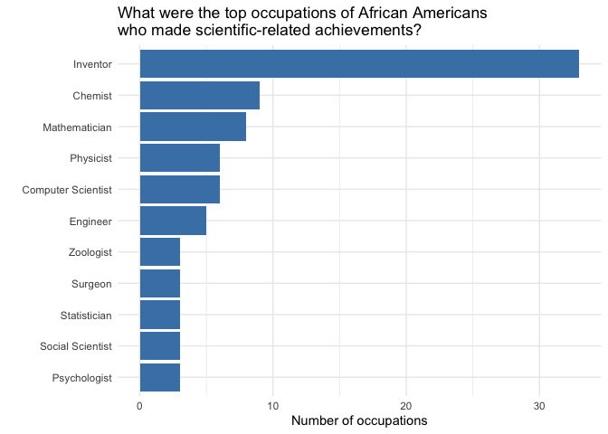
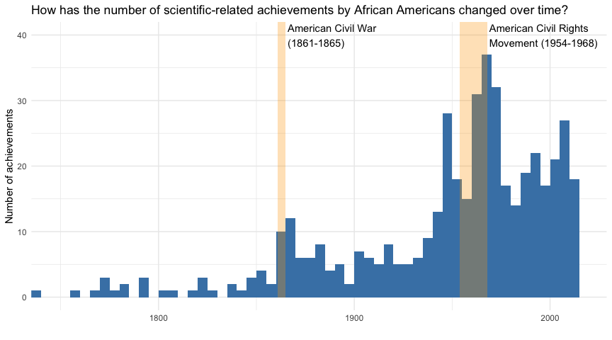
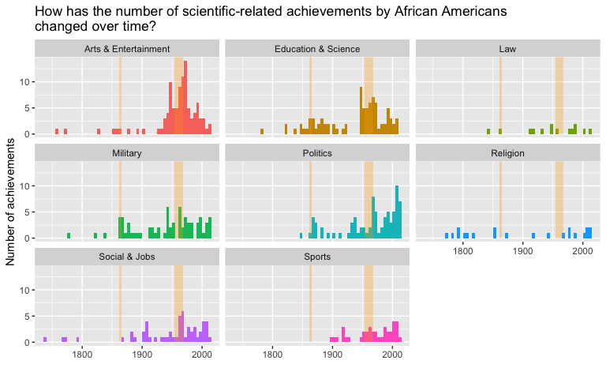

Tidy Tuesday: analyzing African American achievements
================
Shon Inouye

Introduction
------------

This week's Tidy Tuesday data consists of data on African American achievements throughout history. Given the recent events surrounding the Black Lives Matter movement, it seems fitting that we take some time to recognize the achievements of Black individuals and bring attention to the racism that they have faced and continue to face. You can take a look at this week's data and how it was collected on the [Tidy Tuesday GitHub repo](https://github.com/rfordatascience/tidytuesday/blob/master/data/2020/2020-06-09/readme.md):

Questions
---------

-   What were the top occupations of those who have made scientific-related achievements?
-   How has the number of achievements changed over time?
-   How does the distribution of achievement categories change over time?

Analysis
--------

Let's start by loading our packages and data.

``` r
# Load packages
library(tidytuesdayR)
library(tidyverse)
library(lubridate)

# Load data
tt_data <- tt_load(2020, week = 24)
science <- tt_data$science
firsts <- tt_data$firsts
```

### What were the top occupations of those who have made scientific-related achievements?

The first dataset we can look at is the `science` dataset, which contains patents and scientific-related achievements by African Americans. Using this, we can see the types the types of occupations that were held by these individuals to get a better sense of the fields these accomplishments resided in. Many of them had multiple occupations and a data quality issue existed, so some data cleaning is required before moving on to visulizations.

``` r
# Calculate number of occupations
nb_occupations <- science %>% 
  # Fix occupation error
  mutate(occupation_s = str_replace(occupation_s, "ZoologistexplorerAnthropologist", "Zoologist; explorer; Anthropologist")) %>% 
  separate_rows(occupation_s, sep = "\\; ") %>% 
  mutate(occupation_s = str_to_title(occupation_s)) %>% 
  count(occupation_s, sort = T) %>% 
  mutate(occupation_s = fct_reorder(occupation_s, n))

# Plot top occupations
nb_occupations %>% 
  top_n(7, n) %>% 
  ggplot(aes(x = occupation_s, y = n)) +
  geom_col(fill = "steelblue") + 
  coord_flip() + 
  labs(title = "What were the top occupations of African Americans\nwho made scientific-related achievements?",
       y = "Number of occupations",
       x = "") +
  theme_minimal()
```



Out of the 84 distinct occupations, the most common one by far is Inventor. This makes sense given that it is explicitly noted that this list contains patent-related achievements. The individuals that piqued my interest the most after looking at this graph are the 3 African American statisticians: Roland G. Fryer Jr., Albert T. Bharucha-Reid, and David Blackwell.

### How has the number of achievements changed over time?

Using the `firsts` dataset, we can see the achievements from African Americans across a much wider range of topics than in the `science` dataset. We can use this to visualize how the number of achievements has changed over time.

``` r
# Create data for notable time periods
laws <- data.frame(start = c(1861, 1954),
                   end = c(1865, 1968),
                   text = c("American Civil War\n(1861-1865)", "American Civil Rights\nMovement (1954-1968)"))

# Plot histogram of achievements over time
firsts %>% 
  ggplot() + 
  geom_histogram(aes(x = year),
                 breaks = seq(1735,2019,5),
                 fill = "steelblue") + 
  geom_rect(data = laws, 
            aes(xmin = start, xmax = end, ymin = 0, ymax = Inf),
            fill = "orange",
            alpha = 0.3) +
  geom_text(data = laws, 
            aes(label = text, x = end+1, y = 40),
            hjust = 0) + 
  scale_x_continuous(expand = expansion(mult = c(0,0.05))) +
  labs(title = "How has the number of scientific-related achievements by African Americans changed over time?",
       y = "Number of achievements",
       x = "") +
  theme_minimal()
```



We see the first major spike in achievements in the 1860s, which happens to be the decade in which the American Civil War and the resulting 13th, 14th, and 15th amendments to the U.S. Constitution took place. Before the noticable spike in achievements during and after the civil rights movement (1954-1968), we can see another spike in the late 1940s. This matches up with the end of World War II (1945), the aftermath of which [was arguably a major catalyst for the movement](https://www.history.com/news/did-world-war-ii-launch-the-civil-rights-movement).

### How does the distribution of achievement categories change over time?

As mentioned above, we can also look at the different categories for these African American achievements.

``` r
firsts %>% 
  ggplot() + 
  geom_histogram(aes(year),
                 breaks = seq(1735,2019,5)) + 
  geom_rect(data = laws, 
          aes(xmin = start, xmax = end, ymin = 0, ymax = Inf),
          fill = "orange",
          alpha = 0.3) +
  facet_wrap(~category) + 
  aes(fill = category) +
  labs(title = "How has the number of scientific-related achievements by African Americans\nchanged over time?",
       y = "Number of achievements",
       x = "") +
  theme(legend.position = "none") 
```



It seems that achievements in the Military, Politics, and Education & Science categories saw larger spikes on and shortly after after both the Civil War and civil rights movement time periods. On the other hand, it looks as though achivements in Arts & Entertainment and Sports didn't see a significant increase until post-WWII and into the civil rights movement.

This data and these visualizations were not only chosen to recognize the valuable achievements and contributions by African Americans throughout history, but also to highlight the history and impact of race-related events over time. As we move into the future, I have faith that we will continue taking steps towards true racial equality and witness even more increases in these lists of achievements.
